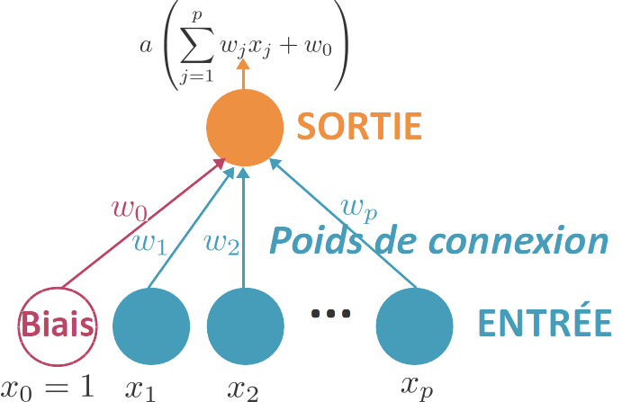

# Codelab Machine Learning : Introduction aux CNNs

Un codelab permettant d'expérimenter le Machine Learning sur des sujets simples de traitement
de l'image avec des **CNNs**.

## Qu’est-ce qu’un CNN ?

Un **réseau de neurones convolutif** est comparable à une méthode traditionnelle d'apprentissage **supervisé** : il reçoit des images en entrée, détecte les *features* de chacune d'entre elles, puis entraîne un classifieur dessus.

Lors de la phase d'entraînement du CNN, les *features* sont extraites et apprises automatiquement, des plus simples au plus sophistiquées, en minimisant l'erreur de classification.

Mais au fait, **qu’est-ce qu’un réseau de neurones** ?

C’est un système composé de **neurones**, généralement répartis en plusieurs couches connectées entre elles.

Chaque entrée d’une couche est associée aux sorties des neurones de la couche précédente et à des **poids**, déterminés au fur et à mesure de l’entrainement du réseau.

Des CNNs évolués enchainent un grand nombre de couches, de différents types, afin d’optimiser leurs prédictions de sortie.

Ci-dessous, le CNN “VGG-16” est composé de 16 couches. Il a été entrainé (historiquement) sur le jeu de données ImageNet (1.2 million d’images, associées à 1000 classes de sortie) pendant plusieurs **semaines**.

# Pré-requis

## Niveau préalable

Avoir lu l’[introduction au Machine Learning](https://www.notion.so/Introduction-au-Machine-Learning-3f52208d8aea4b9581870febbd6ebe92).

Il est préférable d’avoir des notions de Python.

## Config requise

- Laptop
- Windows ✅ / Linux ✅ / Mac OS ✅
- Navigateur web
- Il vous faut également un compte Google.

# Liens

- Aller sur [https://colab.research.google.com/](https://colab.research.google.com/)
- Faire Ouvrir / Github
- Ouvrir successivement les notebooks “**Codelab_Classification_d'images_1.ipynb”** (puis “2”, puis “3”) disponibles à l’URL : [https://github.com/JulienGremillot/codelab_machine_learning](https://github.com/JulienGremillot/codelab_machine_learning)
